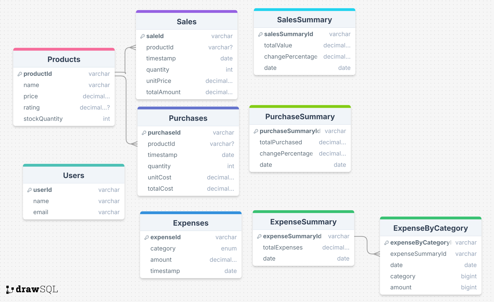
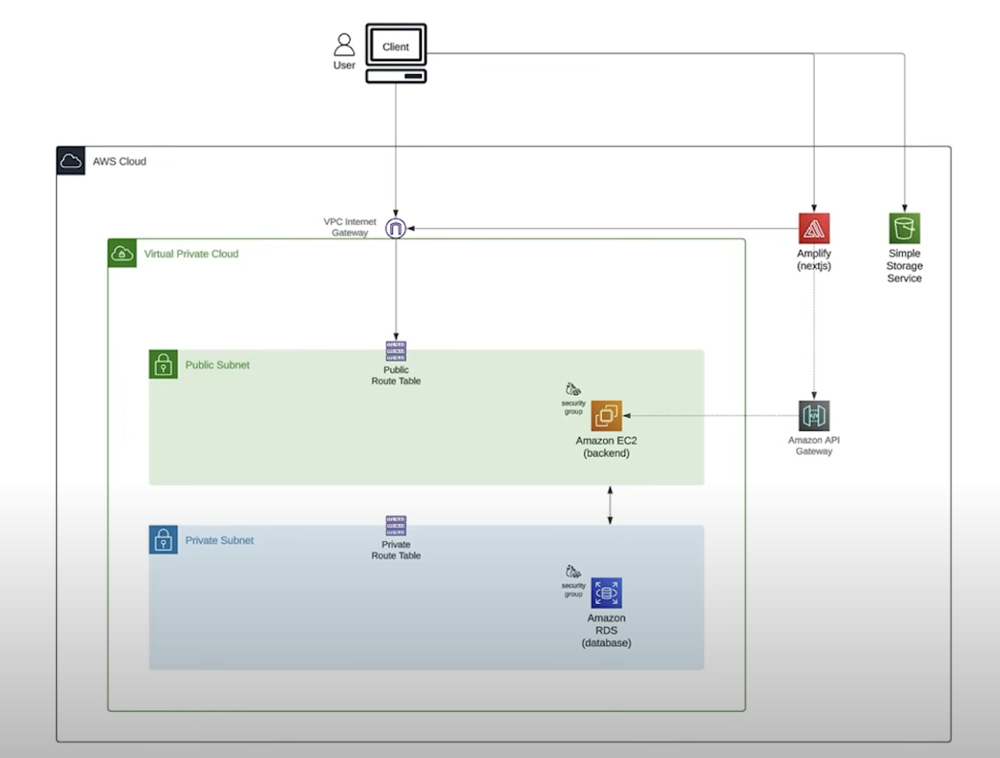

# Inventory and Expense Management Application

## Techstack

- AWS: Amplify, VPC, Cloudfront, Lambda, RDS Postgres
- Frontend: NextJS 15, React 19, MUI datagrid, Tailwind, Redux
- Backend: Express, Prisma

## DynamoDB Relationship Diagram

- 

## Deployment options

### AWS Lambda for Express backend, Amplify for server-side NextJS

- Freetier AWS, except for Amplify and RDS Posgres, but cost less than 5$ a month
- Option to move from AWS RDS Post

### Alternative EC2 for Express and Amplify Web Compute

- This would be good in Production only, for my portfolio, i will keep Backend on Lambda for free-tier applicable
- This would cost around 20$ per month to keep this hosting

### Alternative Fargate ECS

- Scalable and managed container, but more costly, over the scope of this personal project
